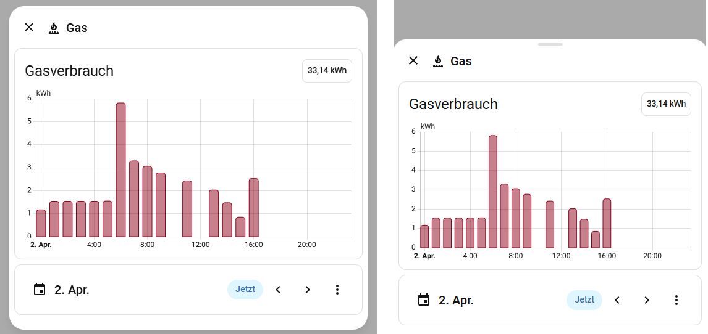

# HA Adaptive Dialog Card

A URL hash-driven popup dialog card that opens when the URL hash matches the configured value. Uses the native `ha-adaptive-dialog` (new since 2026.3.0) for responsive bottom-sheet behavior on mobile.

[](https://github.com/hacs/integration)
[](https://github.com/thecodingdad/ha-adaptive-dialog-card/releases)

## Screenshot



## Features

- Opens/closes via URL hash navigation
- Responsive sizing (small/medium/large/full for desktop; small/medium/large for mobile)
- Optional title, subtitle, and icon in header
- Optional header badge
- Nested card rendering inside dialog
- Prevent close toggle (disable backdrop/escape dismiss)
- Close button position (left, right, hidden)
- Mode change expansion on header click
- Native HA dialog styling and animations
- Jinja2 template support for title
- Popups can be opened from any view of the same dashboard
- EN/DE multilanguage support

## Prerequisites

- Home Assistant 2026.3.0 or newer
- HACS (recommended for installation)

## Installation

### HACS (Recommended)

[](https://my.home-assistant.io/redirect/hacs_repository/?owner=thecodingdad&repository=ha-adaptive-dialog-card&category=plugin)

Or add manually:
1. Open HACS in your Home Assistant instance
2. Click the three dots in the top right corner and select **Custom repositories**
3. Enter `https://github.com/thecodingdad/ha-adaptive-dialog-card` and select **Dashboard** as the category
4. Click **Add**, then search for "HA Adaptive Dialog Card" and download it
5. Reload your browser / clear cache

### Manual Installation

1. Download the latest release from [GitHub Releases](https://github.com/thecodingdad/ha-adaptive-dialog-card/releases)
2. Copy the `dist/` contents to `config/www/community/ha-adaptive-dialog-card/`
3. Add the resource in **Settings** → **Dashboards** → **Resources**:
   - URL: `/local/community/ha-adaptive-dialog-card/ha-adaptive-dialog-card.js`
   - Type: JavaScript Module
4. Reload your browser

## Usage

Add the card to your dashboard:

```yaml
type: custom:ha-adaptive-dialog-card
hash: lights-popup
title: Light Controls
icon: mdi:lightbulb
width_desktop: medium
width_mobile: large
card:
  type: entities
  entities:
    - light.living_room
    - light.bedroom
```

To open the dialog, navigate to `#lights-popup` in the URL (e.g., via a tap action with `navigation_path: "#lights-popup"`).

## Configuration

### Card Options

| Option | Type | Default | Description |
|--------|------|---------|-------------|
| `hash` | string | required | URL hash to monitor (# prefix optional) |
| `title` | string | — | Dialog title (Jinja2 templates supported) |
| `subtitle` | string | — | Dialog subtitle |
| `icon` | string | — | Header icon (MDI) |
| `header_badge` | object | — | Badge config for header |
| `width_desktop` | string | medium | Desktop dialog size (small/medium/large/full) |
| `width_mobile` | string | medium | Mobile dialog size (small/medium/large) |
| `min_height_desktop` | string | — | Minimum height on desktop |
| `min_height_mobile` | string | — | Minimum height on mobile |
| `prevent_close` | boolean | false | Prevent closing via backdrop/escape |
| `close_position` | string | right | Close button position (left/right/hidden) |
| `allow_mode_change` | boolean | false | Allow expanding on header click |
| `card` | object | required | Nested card configuration |

## Multilanguage Support

This card supports English and German.

## License

This project is licensed under the MIT License - see the [LICENSE](LICENSE) file for details.
